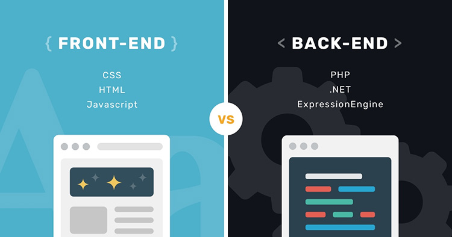

# nginx,nodejs,mysql 도커



## docker 
- docker-compose up -d build를 통해 백그라운드와 빌드를 동시 가능
- docker-compose에서 command를 통해 시작할때 서버와 mysql nginx가 실행되게 하였다.

## node.js - express
- Login : passport 사용 (로그인 사용할때 필수적으로 사용되는 모듈)
<a href="http://www.passportjs.org/">passport.js</a>
- helmet : http header의 보안관련 모듈
- morgan : express 내에서 로그 기록 남김
- express -view=ejs 폴더명 (express를 써서 간단한 필요 모듈을 설치하자)


## nginx
- nginx -g daemon off 명령어로 현재 백그라운드에서 실행
- nginx는 리버스 프록시 서버(어플리케이션과 클라이언트 사이에서 중계를 해주는 친구)
 - nginx기능 : 로드 밸런싱, 보안, 가속화 기타 등등
 ```js
로드 밸런싱의 예제 
 upstream testserver{
                least_conn;
                server 1**.***.**.**:8801 weight=10
                server 2**.***.**.**:8801 weight=10
                server 3**.***.**.**:8801 weight=10
                server 4**.***.**.**:8801 weight=10
 ```
 - docker에서는 --daemon off을 해주지 않으면 포그라운드에서 작동하기 때문에 꺼진다.

## pm2
- 싱글 스레드의 node.js를 보완하는 프로세스 매니저
- 한개의 코어만 사용하면 자원 활용이 취약하기 때문에 pm2로 클러스터 기능을 발휘할수있다.
- 기본적인 사용법은 pm2 start index.js
- --watch명령어가 뒤에 붙게되면 파일의 변화를 감지해서 바꿔준다.
- docker에서는 --no daemon 을 해주지 않으면 포그라운드에서 작동하기 때문에 꺼진다.
- pm2 plus를 통해 pm2사이트에서 gui로 관리하거나 내용을 볼수있다.
- pm2 plus는 유료이나 간단한 기능은 무료로 제공(무료의 pm2 monit도 있다)
``` js
pm2 stop <filename>
pm2 delete <filename>
pm2 log [<filename>]
pm2 list
pm2 monit
pm2 kill
pm2 show API
```
<a href="https://pm2.keymetrics.io/"> pm2 </a>

## mysql-sequelize
- ORM을 지원해주는 라이브러리
- 하지만 우리는 코드로 테이블을 귀찮기 때문에 workbench er 다이어그램 으로  테이블을 만들것이다.
- 만든 테이블은 sequelize auto로 만들어진 테이블을 코드화를 진행.
```js
sequelize-auto -o "./models" -d DB이름 -h localhost -u root -p 3306 -x root -e mysql
```
- 위 명령어를 통해 er다이어 그램으로 만들어진 테이블이 /usr/src/app/model안에 들어가게 될것이다.
- 그뒤 부터는 orm을 사용하면된다.
- orm을 사용하는것은 backend의 springboot에서 가장 많이 쓰이는 방식으로 알아두면 도움이 될거같아 쓰게되었다.
- 참고 사이트
- <a href="https://thebook.io/080229/ch07/06/"> 제로초의 sequelize(최근 방식 적용) </a>
- <a href="https://velog.io/@cadenzah/sequelize-document-1"> 예전 공식 문서번역 </a>
- <a href="https://github.com/sequelize/sequelize-auto">sequelize-auto(최근 방식 적용) </a>

## 환경
- 알파인 
- http://localhost:80/
- mysql : ip: localhost , port 3306

## 해야할일
- [ ] 백엔드 문서 설계화
- [ ] rest-API 통신 문서 설계화
- [x] 개발환경  구축
- [ ] 로그인 구현 
- [ ] 받아오는 자료에 대한 CRUD
- [ ] 앱과의 통신
- [ ] 로드 밸런싱
- [ ] AWS나 학교 서버에 배포  


